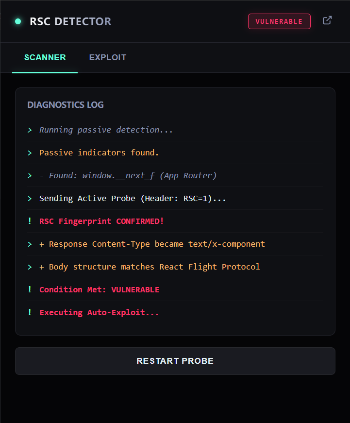

# RSC Security Scanner

A browser extension for detecting **React Server Components (RSC)** and **Next.js App Router** fingerprints.

[FOFA Search Guide](./docs/fofa_guide.md) - Learn how to use FOFA to find vulnerable RSC sites while excluding Cloudflare/WAF protection.

- 🔍 **Passive Scan** - Automatically detect RSC/Next.js indicators in page content
- 🎯 **Active Fingerprint** - Probe server responses with `RSC: 1` header
- 🛡️ **WAF Detection** - Identify common WAFs (Cloudflare, AWS, Akamai, etc.)
- ⚡ **RCE Exploit** - Test CVE vulnerabilities in Next.js Server Actions

| SCANNER                                           | EXPLOIT                                                      |
| ------------------------------------------------- | ------------------------------------------------------------ |
|  |  |


## Installation

### Chrome / Edge

1. Download `rsc-security-scanner.zip` from [Releases](https://github.com/QIN2DIM/rsc-security-scanner/releases)
2. Unzip the file
3. Open `chrome://extensions/` (or `edge://extensions/`)
4. Enable **Developer mode** (toggle in top right)
5. Click **Load unpacked** and select the unzipped folder

### Firefox

1. Download `rsc-security-scanner.xpi` from [Releases](https://github.com/QIN2DIM/rsc-security-scanner/releases)
2. Open Firefox and drag the `.xpi` file into the browser window
3. Click **Add** to confirm installation

> ✅ The Firefox extension is signed and can be permanently installed.

## Usage

1. Navigate to any website you want to scan
2. Click the extension icon in your browser toolbar
3. The extension will automatically detect RSC/Next.js fingerprints
4. Use the **Exploit** tab to test for vulnerabilities (if detected)

---

## Building from Source

<details>
<summary>Click to expand (for developers)</summary>

### Prerequisites

- Node.js >= 18
- pnpm

### Build Commands

```bash
# Install dependencies
pnpm install

# Development build (unsigned)
pnpm run build:dev
# Output: dist/dev/

# Release build (signed Firefox extension)
pnpm run build:release
# Output: dist/release/
```

### Firefox Signing

To create a signed Firefox extension, you need Mozilla AMO API credentials:

1. Get API keys from [Mozilla AMO](https://addons.mozilla.org/developers/addon/api/key/)
2. Create `.env.local` with your credentials:
   ```
   WEB_EXT_API_KEY=user:xxxxx:xxx
   WEB_EXT_API_SECRET=your-secret
   ```
3. Run `pnpm run build:release`

</details>


## License

GPL-3.0
